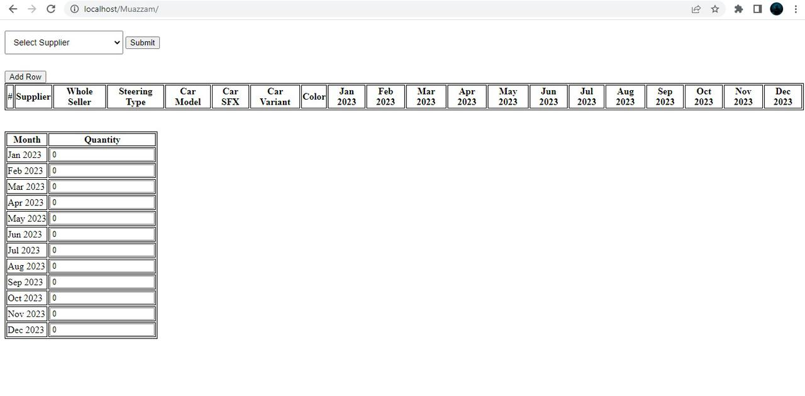
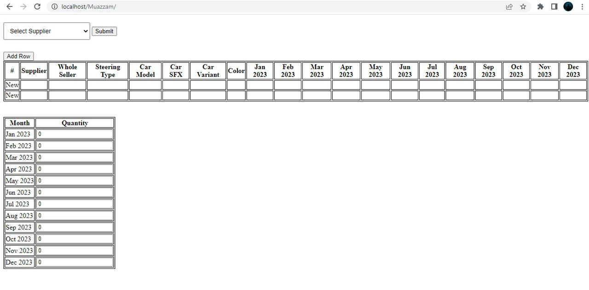
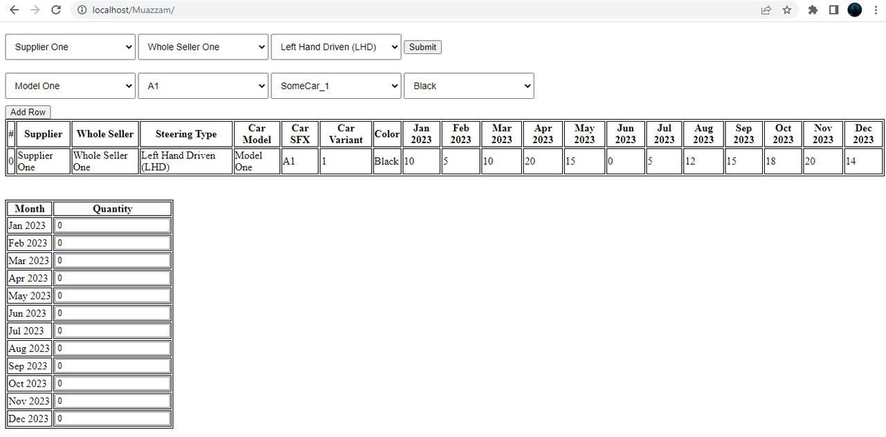
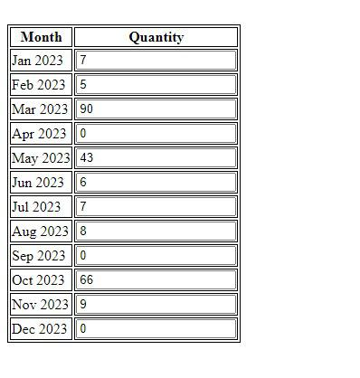

# FilteredAssignment

## Introduction

In this document, I will describe the technologies and logical techniques used in the design and development of a run-time filter system based on dropdowns. The system must have 3 major selections and 4 minor selections, and must be able to store and update data in real-time without refreshing the page. The data will be stored and retrieved using a MySQL database, and the front-end will be built using PHP, jQuery, and AJAX.

## Technologies Used

PHP Core: PHP is used as the primary programming language to develop the server-side logic for the filter system. PHP scripts will be used to retrieve data from the database and generate dynamic content for the web pages.

jQuery: jQuery is used to enhance the user interface and add interactivity to the filter system. With jQuery, I can add animations, event handlers, and other dynamic effects to the dropdown menus and other elements on the page.

AJAX: AJAX is used to communicate with the server and retrieve data from the database in real-time, without having to refresh the page. This allows for a seamless user experience as the data is updated dynamically based on the user's selections.

## Logical Techniques Used

Dropdown Menus: The filter system is based on dropdown menus, where the user can select their preferred options. The selected options will be passed to the server using AJAX, which will retrieve the relevant data from the database and update the page dynamically.

Data Retrieval: The data is retrieved from the MySQL database using PHP scripts. The scripts will generate SQL queries based on the user's selections and retrieve the relevant data from the database.

Real-time Data Updates: The system uses AJAX to communicate with the server and retrieve data from the database in real-time. This allows the data to be updated dynamically as the user makes selections, without having to refresh the page.

## Conclusion

In conclusion, the run-time filter system is designed and developed using PHP, jQuery, and AJAX, with a focus on efficient and reliable data management using a MySQL database. The system uses dropdown menus and AJAX to allow for real-time data updates and a seamless user experience.

### UI

